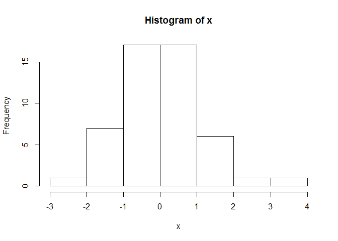
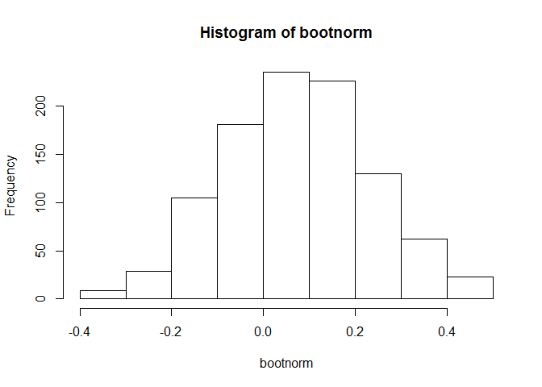
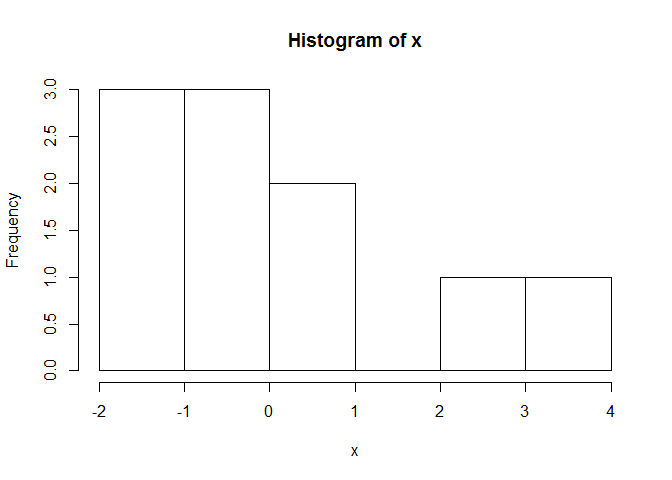
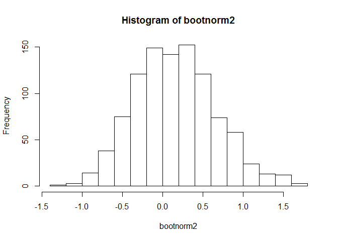
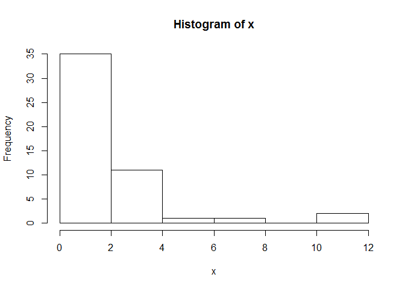
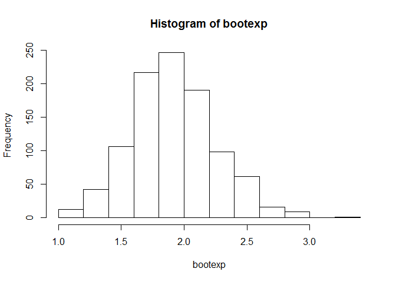
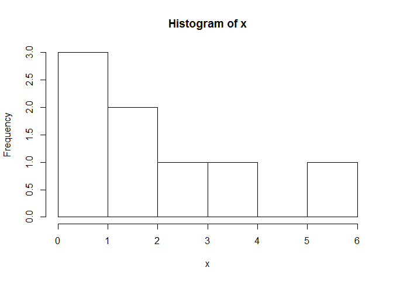
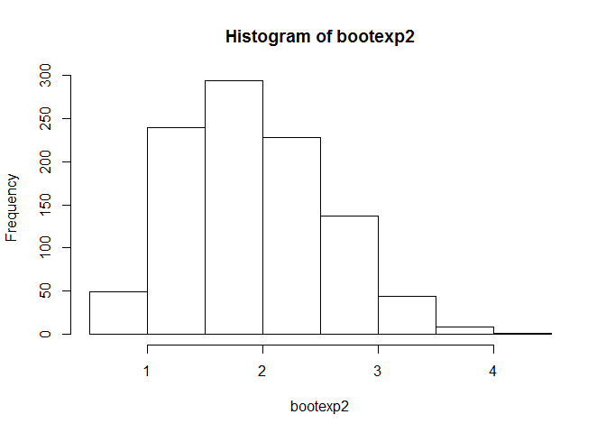

# Homework4
Johnny Quick  
June 1, 2016  

Write bootstrap code to illustrate the central limit theorem in R markdown 
and push the result to GitHub. Use a normal distribution with two different 
sample sizes and an exponential distribution with two different sample sizes. 
Correct code alone is insufficient. Please also comment on the code and 
explain the results. For help, see the lotsa.medians function in unit 2. The 
deliverable is a link to a GitHub repo containing the code.

## Normal distribution with bootstrap sample size of 50

```r
## Get normal distribution of size 50
x <- rnorm(50)

## Get mean of random normal distribution sample
xbar <- mean(x)

## Init number of simulations to 1000
nsims <- 1000

## Init bootnorm 
bootnorm <- numeric(nsims)

## Loop through and take 50 samples each time, replace = TRUE means a number can
##    can be chose more than once in the sample. Place result in bootnorm
## Then take the mean of the sample each time

for (i in 1:nsims) {
  temp <- sample(x, length(x), replace=TRUE)
  bootnorm[i] <- mean(temp)
}

hist(x)
```

<!-- -->

```r
hist(bootnorm)
```

<!-- -->

The data is normally distributed for both the original sample distribution and the means of the sample distribution taken from the original sample distribution. This is because with the central limit theorem, if we take 30 or more samples, the means of all the samples create a normal distribution.

## Normal distribution with bootstrap sample size of 10

```r
## Get normal distribution of size 10
x <- rnorm(10)

bootnorm2 <- numeric(nsims)

## This time, loop through and take 10 samples each time.
##    Place result in bootnorm2
## Then take the mean of the sample each time

for (i in 1:nsims) {
  temp2 <- sample(x, length(x), replace=TRUE)
  bootnorm2[i] <- mean(temp2)
}

hist(x)
```

<!-- -->

```r
hist(bootnorm2)
```

<!-- -->

The data is normally distributed for both the original sample distribution and the means of the sample distribution taken from the original sample distribution. This happens because our original distribution was a normal distribution.

## Exponential distribution with bootstrap sample size of 50

```r
## Get exponential distribution of size 50 rate of 0.5
x <- rexp(50, 0.5)

## Get mean of random exponential distribution sample
xbar <- mean(x)

## Init number of simulations to 1000
nsims <- 1000

## Init bootexp 
bootexp <- numeric(nsims)

## Loop through and take 50 samples each time, replace = TRUE means a number can
##    can be chosen more than once in the sample. Place result in bootexp
## Then take the mean of the sample each time

for (i in 1:nsims) {
  temp <- sample(x, length(x), replace=TRUE)
  bootexp[i] <- mean(temp)
}
hist(x)
```

<!-- -->

```r
hist(bootexp)
```

<!-- -->

The histogram of the original exponential distribution is right skewed whereas the histogram of the 1000 sample means is normally distributed. This shows the central limit theorem in action because when the population is not normally distributed, we can take multiple samples (at least 30 samples) and the means of those samples will be normally distributed.

## Exponential distribution with bootstrap sample size of 8

```r
## Get exponential distribution of size 8 with rate of 0.5
x <- rexp(8)

## Get mean of random exponential distribution sample
xbar <- mean(x)

## Init number of simulations to 1000
nsims <- 1000

## Init bootexp2 
bootexp2 <- numeric(nsims)

## Loop through and take 8 samples each time, replace = TRUE means a number can
##    can be chosen more than once in the sample. Place result in bootexp2
## Then take the mean of the sample each time

for (i in 1:nsims) {
  temp <- sample(x, length(x), replace=TRUE)
  bootexp2[i] <- mean(temp)
}
hist(x)
```

<!-- -->

```r
hist(bootexp2)
```

<!-- -->

The histogram of the original exponential distribution is right skewed, and the histogram of the 1000 sample means is right skewed also. This shows the central limit theorem in action because when the population is not normally distributed, we can take multiple samples (at least 30 samples) and the means of those samples will be normally distributed. Since we took only 8 samples, the central limit theorem is not in play and causes the data to remain right skewed.
